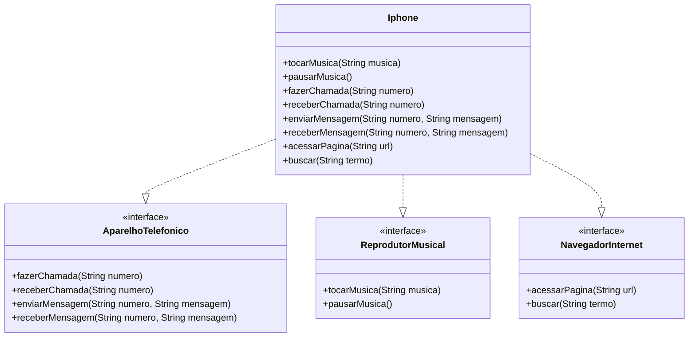

# Simulador de iPhone em Java

Esse projeto é uma simulação simples de um iPhone usando os conceitos básicos de Programação Orientada a Objetos (POO) com Java. A ideia foi separar os comportamentos em interfaces e ter uma classe `Iphone` que implementa tudo isso.

Tudo funciona via terminal, sem interface gráfica, focado no aprendizado de POO — encapsulamento e interfaces.

---

## Diagrama UML



---

## O que cada parte faz

### Reprodutor Musical
- `tocarMusica(String musica)`: imprime que a música está tocando.
- `pausarMusica()`: simula a pausa da música atual.

### Aparelho Telefônico
- `fazerChamada(String numero)`: simula a ligação para um número.
- `receberChamada(String numero)`: simula o recebimento de uma ligação de um número.
- `enviarMensagem(String numero, String mensagem)`: simula o envio de uma mensagem para um número.
- `receberMensagem(String numero, String mensagem)`: simula o recebimento de uma mensagem de um número.

### Navegador de Internet
- `acessarPagina(String url)`: simula o acesso a uma página fictícia.
- `buscar(String termo)`: simula uma busca na internet.

---

## Objetivo

O foco aqui é praticar os pilares da programação orientada a objetos de forma prática e didática:

- Organização com interfaces
- Implementação em uma classe concreta
- Simulação de funcionalidades no terminal

---

## Como rodar

1. Clone o projeto:
   ```bash
   git clone https://github.com/seu-usuario/iphone-simulator.git
   cd iphone-simulator
   ```

2. Compile os arquivos:
   ```bash
   javac dispositivo/*.java aparelho/*.java musica/*.java navegador/*.java Main.java
   ```

3. Execute:
   ```bash
   java Main
   ```

---

## Funcionalidades

Ao rodar o programa, você verá um menu no terminal com as seguintes opções:

1. Fazer Chamada
2. Receber Chamada
3. Enviar Mensagem
4. Receber Mensagem
5. Tocar Música
6. Pausar Música
7. Acessar Página
8. Buscar na Internet
0. Sair

Escolha uma opção e siga as instruções no terminal para simular as funcionalidades do iPhone.

---

## Estrutura do Projeto

- **`dispositivo/Iphone.java`**: Implementa todas as interfaces e centraliza as funcionalidades.
- **`aparelho/AparelhoTelefonico.java`**: Interface que define as funcionalidades de um telefone.
- **`musica/ReprodutorMusical.java`**: Interface que define as funcionalidades de um reprodutor musical.
- **`navegador/NavegadorInternet.java`**: Interface que define as funcionalidades de um navegador de internet.
- **`Main.java`**: Classe principal que controla o menu e as interações com o usuário.