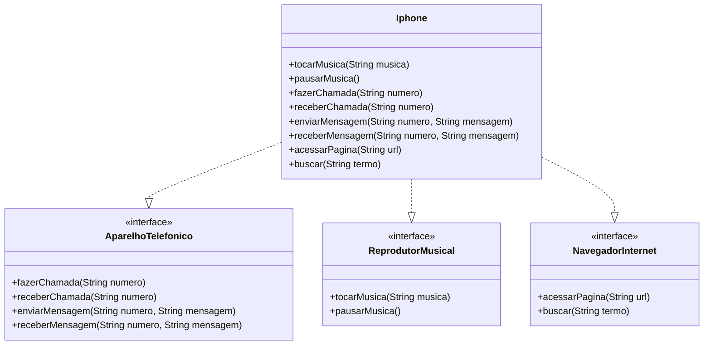

# Simulador de iPhone em Java

Esse projeto é uma simulação simples de um iPhone usando os conceitos básicos de Programação Orientada a Objetos (POO) com Java. A ideia foi separar os comportamentos em interfaces e ter uma classe `iPhone` que implementa tudo isso.

Tudo funciona via terminal, sem interface gráfica, focado no aprendizado de POO mesmo — encapsulamento, interfaces, organização das classes, etc.

---

## Diagrama UML



---

## O que cada parte faz

### Reprodutor Musical
- `tocarMusica(nome)`: imprime que a música está tocando.
- `pausarMusica()`: simula a pausa da música atual.
- `selecionarMusica(nome)`: troca a música atual.

### Aparelho Telefônico
- `fazerChamada(numero)`: simula a ligação pra alguém.
- `receberChamada()`: simula alguém te ligando.
- `encerrarChamada()`: encerra a ligação.

### Navegador de Internet
- `abrirPagina(url)`: abre uma página fictícia.
- `adicionarAosFavoritos(url)`: salva o link nos favoritos.
- `atualizarPagina()`: recarrega a página atual.

---

## Objetivo

O foco aqui é praticar os pilares da programação orientada a objetos de forma prática e didática:

- Organização com interfaces
- Implementação em uma classe concreta
- Simulação de funcionalidades no terminal

---

## Como rodar

1. Clona o projeto:
   ```bash
   git clone https://github.com/seu-usuario/iphone-simulator.git
   cd iphone-simulator
   ```

2. Compila os arquivos:
   ```bash
   javac *.java
   ```

3. Executa:
   ```bash
   java Main
   ```

---
